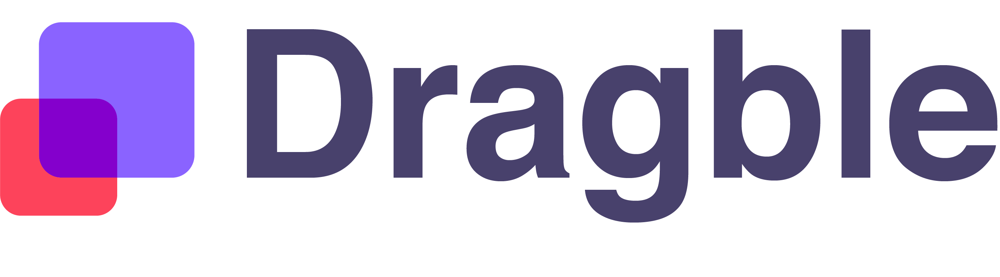

<p align="center">
  <a href="https://dragble.com">
    
  </a>
</p>

<p align="center">
  <a href="https://www.npmjs.com/package/dragble-angular-editor"></a>
  <a href="https://github.com/Dragble/dragble-angular-editor/blob/main/LICENSE"></a>
</p>

# dragble-angular-editor

The **fully AI-powered** Angular editor for **email templates** and **landing pages**. Your end-users design visually with drag-and-drop — or describe what they want and watch AI agents build it live on the canvas. Powered by the built-in **Model Context Protocol (MCP)** server, connect [Claude Code](https://claude.com/code), [OpenCode](https://opencode.ai), [Codex](https://github.com/openai/codex), [Cursor](https://cursor.com), or your own AI backend directly to the editor. Structured tool calls mean guaranteed-valid output — no prompt engineering, no JSON hallucination, no broken layouts.

[Dragble](https://dragble.com) brings two design experiences together in one Angular component: a polished visual editor for designers and a conversational AI surface for everyone else — backed by structured tool calls that produce guaranteed-valid HTML emails and landing pages every time.

[Website](https://dragble.com) | [Documentation](https://docs.dragble.com) | [Dashboard](https://developers.dragble.com)

<p align="center">
  
</p>

## Features

- Drag-and-drop **email template builder** with 20+ content blocks
- **Fully AI-powered via MCP** — connect AI agents (Claude Code, OpenCode, Codex, Cursor) or your own AI backend to build designs live on the canvas. Structured tool calls mean guaranteed-valid output — no prompt engineering, no JSON hallucination
- Responsive **HTML email** output compatible with all major email clients
- **Newsletter editor** with merge tags, dynamic content, and display conditions
- Visual **email designer** — no HTML/CSS knowledge required for end users
- Export to HTML, JSON, image, PDF, or ZIP
- Built-in image editor, AI content generation, and collaboration tools
- Full TypeScript support
- Works with NgModule and standalone components (Angular 14+)

## Installation

The SDK is loaded from CDN automatically — you only need to install the Angular package.

```bash
npm install dragble-angular-editor
```

```bash
yarn add dragble-angular-editor
```

```bash
pnpm add dragble-angular-editor
```

## Editor Key

An `editorKey` is required to use the editor. You can get one by creating a project on the [Dragble Developer Dashboard](https://developers.dragble.com).

## Usage

### NgModule

```typescript
import { NgModule } from "@angular/core";
import { BrowserModule } from "@angular/platform-browser";
import { DragbleEditorModule } from "dragble-angular-editor";
import { AppComponent } from "./app.component";

@NgModule({
  declarations: [AppComponent],
  imports: [BrowserModule, DragbleEditorModule],
  bootstrap: [AppComponent],
})
export class AppModule {}
```

```typescript
import { Component, ViewChild } from "@angular/core";
import {
  DragbleEditorComponent,
  DesignJson,
  DragbleSDK,
} from "dragble-angular-editor";

@Component({
  selector: "app-email-editor",
  template: `
    <div class="toolbar">
      <button (click)="handleSave()">Save</button>
      <button (click)="handleExport()">Export HTML</button>
    </div>
    <dragble-editor
      #editor
      [editorKey]="'YOUR_EDITOR_KEY'"
      [editorMode]="'email'"
      [height]="800"
      (ready)="onReady($event)"
      (change)="onChange($event)"
    ></dragble-editor>
  `,
})
export class EmailEditorComponent {
  @ViewChild("editor") editor!: DragbleEditorComponent;

  onReady(sdk: DragbleSDK): void {
    console.log("Editor ready!", sdk);
  }

  async onChange(data: { design: DesignJson; type: string }): Promise<void> {
    // Design JSON is available directly from the callback
    console.log("Design JSON:", data.design);

    // To get HTML, call exportHtml on the editor
    const html = await this.editor.exportHtml();
    console.log("HTML:", html);
  }

  async handleSave(): Promise<void> {
    const design = await this.editor.getDesign();
    console.log("Design:", design);
  }

  async handleExport(): Promise<void> {
    const html = await this.editor.exportHtml();
    console.log("HTML:", html);
  }
}
```

### Standalone Component (Angular 17+)

```typescript
import { Component, ViewChild } from "@angular/core";
import { DragbleEditorComponent } from "dragble-angular-editor";

@Component({
  selector: "app-editor",
  standalone: true,
  imports: [DragbleEditorComponent],
  template: `
    <dragble-editor
      #editor
      [editorKey]="'YOUR_EDITOR_KEY'"
      [editorMode]="'email'"
      (ready)="onReady($event)"
    ></dragble-editor>
  `,
})
export class EditorComponent {
  @ViewChild("editor") editor!: DragbleEditorComponent;

  onReady(): void {
    console.log("Editor ready!");
  }
}
```

## Complete Example

```typescript
import { Component, ViewChild } from "@angular/core";
import {
  DragbleEditorComponent,
  DesignJson,
  DragbleSDK,
  EditorOptions,
} from "dragble-angular-editor";

@Component({
  selector: "app-advanced-email-builder",
  standalone: true,
  imports: [DragbleEditorComponent],
  styles: [
    `
      .advanced-email-builder {
        height: 100vh;
        display: flex;
        flex-direction: column;
      }

      .toolbar {
        padding: 12px;
        border-bottom: 1px solid #ddd;
        display: flex;
        gap: 8px;
        align-items: center;
      }

      .dirty-indicator {
        color: orange;
      }
    `,
  ],
  template: `
    <div class="advanced-email-builder">
      <div class="toolbar">
        <button type="button" (click)="editor.undo()">Undo</button>
        <button type="button" (click)="editor.redo()">Redo</button>
        <button type="button" (click)="editor.showPreview('desktop')">
          Preview
        </button>
        <button type="button" (click)="handleExportHtml()">Export HTML</button>
        <button type="button" (click)="handleExportImage()">
          Export Image
        </button>
        <span *ngIf="isDirty" class="dirty-indicator">Unsaved changes</span>
      </div>

      <dragble-editor
        #editor
        [editorKey]="'your-editor-key'"
        [editorMode]="'email'"
        [height]="'100%'"
        [designMode]="'live'"
        [options]="editorOptions"
        (ready)="handleReady($event)"
        (change)="handleChange($event)"
        (error)="handleError($event)"
      ></dragble-editor>
    </div>
  `,
})
export class AdvancedEmailBuilderComponent {
  @ViewChild("editor") editor!: DragbleEditorComponent;

  isDirty = false;

  editorOptions: EditorOptions = {
    appearance: { theme: "light" },
    features: {
      preview: true,
      undoRedo: true,
      imageEditor: true,
    },
  };

  handleReady(editor: DragbleSDK): void {
    // Set merge tags (must pass a MergeTagsConfig object)
    editor.setMergeTags({
      customMergeTags: [
        { name: "First Name", value: "{{first_name}}" },
        { name: "Last Name", value: "{{last_name}}" },
        { name: "Company", value: "{{company}}" },
      ],
      excludeDefaults: false,
      sort: true,
    });

    // Set custom fonts
    editor.setFonts({
      showDefaultFonts: true,
      customFonts: [{ label: "Brand Font", value: "BrandFont, sans-serif" }],
    });

    // Load saved design if available
    const savedDesign = localStorage.getItem("email-design");
    if (savedDesign) {
      editor.loadDesign(JSON.parse(savedDesign));
    }
  }

  handleChange(data: { design: DesignJson; type: string }): void {
    this.isDirty = true;
    localStorage.setItem("email-design", JSON.stringify(data.design));
  }

  async handleExportHtml(): Promise<void> {
    const html = await this.editor.exportHtml();
    const blob = new Blob([html], { type: "text/html" });
    const url = URL.createObjectURL(blob);
    const a = document.createElement("a");
    a.href = url;
    a.download = "email.html";
    a.click();
    URL.revokeObjectURL(url);
  }

  async handleExportImage(): Promise<void> {
    const data = await this.editor.exportImage();
    window.open(data.url, "_blank");
  }

  handleError(error: Error): void {
    console.error(error.message);
  }
}
```

## MCP — AI Integration

Connect AI agents (Claude Code, OpenCode, Codex, Cursor, or your own AI backend) to the editor through the [Model Context Protocol](https://modelcontextprotocol.io). Your backend uses `mcp_key`; third-party AI clients use `mcp_client_key` plus a pairing code. Tool calls mutate design state live on the canvas. No prompt engineering, no JSON hallucination, no broken output.

### Enabling MCP

MCP is on by default when your plan includes it. You can still set `features: { mcp: true }` explicitly, or set `features: { mcp: false }` to turn it off for an embed:

```html
<dragble-editor
  #editor
  [editorKey]="'db_pxl81cxn92wignwx'"
></dragble-editor>
```

MCP also requires a **Starter plan or higher**. Both conditions must be true — plan allows it AND SDK has not opted out.

### Quick example — your backend controls the AI

```typescript
import { Component, ViewChild } from "@angular/core";
import { DragbleEditorComponent } from "dragble-angular-editor";

@Component({
  selector: "app-editor",
  template: `
    <button (click)="handleConnectAI()">Connect AI</button>
    <dragble-editor
      #editor
      [editorKey]="'db_pxl81cxn92wignwx'"
    ></dragble-editor>
  `,
})
export class EditorComponent {
  @ViewChild("editor") editor!: DragbleEditorComponent;

  async handleConnectAI() {
    // The id is YOUR identifier — derive it from your own database/session
    // so the same user editing the same document always gets the same MCP
    // session. Example: if your logged-in user is "alice123" and they're
    // editing document "campaign-summer-2026", build an id like this:
    //
    //   const id = "alice123-campaign-summer-2026";
    //
    // Format rules: 8-128 chars, only letters/digits/hyphens/underscores.
    const userIdFromAuth = "alice123"; // from your auth/session
    const docIdFromRoute = "campaign-summer"; // from your URL or DB row
    const id = `${userIdFromAuth}-${docIdFromRoute}`;
    const { sessionId } = await this.editor.getEditor()!.joinMCP({ id });
    // Pass sessionId to your backend — it calls MCP tools with your backend mcp_key
  }
}
```

### Quick example — end-user pairs their own AI client

```typescript
const handleLetUserPair = async () => {
  const editor = this.editor.getEditor()!;
  // Same id you'd use anywhere else for this user+document combination.
  // 8-128 chars, only letters/digits/hyphens/underscores.
  const id = "alice123-campaign-summer-2026";
  const { code, expiresAt } = await editor.startMCPPairing({ id });
  alert(`Paste this into Claude Code: ${code}`);
};
```

### One controller per session

Each session can be controlled by **either** your backend **or** an end-user's AI client (Claude Code, OpenCode), never both at the same time:

- If your backend makes the first tool call → session is locked to **backend**. Pairing codes are rejected.
- If a user pairs via pairing code first → session is locked to **paired client**. Backend tool calls are rejected.

This prevents two AI controllers from conflicting on the same design.

### How it works

1. **Confirm MCP is enabled**: it is on by default; set `features: { mcp: false }` only when you want to opt out.
2. **Generate MCP keys** in the Dragble dashboard: use backend `mcp_key` for your server, and `mcp_client_key` for Claude/OpenCode/Cursor/Codex-style clients.
3. **Call `editor.joinMCP({ id })`** where `id` is a stable identifier you control (see below).
4. **Choose your AI path**: either your backend calls MCP tools directly (using `mcp_key`), or you generate a pairing code for the end-user to connect their own AI client (using `mcp_client_key`).
5. **Mutations stream live** onto the editor canvas as the AI works.

### The `id` parameter — why it matters

The `id` you pass to `joinMCP()` is a **Bring Your Own ID (BYOI)** that maps to your domain entities. It is NOT a random token — it is how Dragble identifies the session across browser refreshes, server restarts, and device switches.

**Rules:**

- 8–128 characters long
- Only letters, numbers, hyphens, and underscores (`a-z A-Z 0-9 - _`)
- Must be deterministic — the same user editing the same document should always produce the same `id`

**Why these rules?**

- The `id` is used in database lookups and URL paths — special characters or extreme lengths would break routing
- Same `id` = resume the same session. Random UUIDs mean every page refresh creates a new session and loses AI context
- Short IDs (< 8 chars) are too easy to guess, long IDs (> 128 chars) waste storage

```typescript
// Recommended: derive from your domain — concrete examples
editor.joinMCP({ id: "alice123-campaign-summer-2026" }); // user + doc
editor.joinMCP({ id: "workspace_acme_template_welcome" }); // workspace + template
editor.joinMCP({ id: "org-uber-eats-promo-q4-2026" }); // org + campaign
editor.joinMCP({ id: "tenant_42_invoice_template_v3" }); // tenant + entity

// Valid but NOT recommended — random IDs break session continuity
// (every page refresh creates a brand new session, AI loses context)
editor.joinMCP({ id: crypto.randomUUID() });
```

### Disconnecting

`disconnectMCP()` permanently destroys the session — the session cannot be reopened:

```typescript
const { destroyed } = await editor.disconnectMCP();
```

Your backend can also force-destroy a session server-side (e.g., when a user's subscription ends):

```bash
curl -X DELETE https://mcp.dragble.com/sessions/user-42-doc-99 \
  -H "X-API-Key: db_mcp_your_key_here"
```

Idle sessions are reaped after 2 hours of inactivity. Active sessions never expire — each tool call resets the timer.

### MCP method reference

| Method                                             | Returns                                                                 |
| -------------------------------------------------- | ----------------------------------------------------------------------- |
| `editor.joinMCP({ id, editorMode? })`              | `{ sessionId, resumed? }` for backend-managed flows                     |
| `editor.startMCPPairing({ id, editorMode? })`      | `{ sessionId, resumed?, code, expiresAt }` for client pairing           |
| `editor.disconnectMCP()`                           | `{ destroyed }` — permanently deletes session                           |
| `editor.getPairingCode()`                          | `{ code, expiresAt }` — generate a pairing code for end-user AI clients |
| `editor.endPairing()`                              | `{ revoked }` — invalidate the active pairing code                      |
| `editor.getMCPStatus()`                            | `{ paired: true, sessionId } \| { paired: false, reason? }`             |
| `editor.onAIToolFired(cb)`                         | unsubscribe fn — fires when AI calls any tool                           |

### Full documentation

- [MCP Overview](https://docs.dragble.com/mcp-server/overview)
- [Credentials & Security](https://docs.dragble.com/mcp-server/credentials)
- [AI Client Setup (OpenCode, Claude Code, Codex, etc.)](https://docs.dragble.com/mcp-server/ai-client-setup)

## Inputs

| Input               | Type                                     | Default      | Description                           |
| ------------------- | ---------------------------------------- | ------------ | ------------------------------------- |
| `editorKey`         | `string`                                 | **required** | Editor key for authentication         |
| `design`            | `DesignJson \| ModuleData \| null`       | `undefined`  | Initial design to load                |
| `editorMode`        | `EditorMode`                             | `"email"`    | `"email"`, `"web"`, or `"popup"`      |
| `popup`             | `PopupConfig`                            | `undefined`  | Popup configuration                   |
| `contentType`       | `EditorContentTypeValue`                 | `undefined`  | Set to `"module"` for single-row mode |
| `ai`                | `AIConfig`                               | `undefined`  | AI features configuration             |
| `locale`            | `string`                                 | `undefined`  | UI locale                             |
| `translations`      | `Record<string, Record<string, string>>` | `undefined`  | Translation overrides                 |
| `textDirection`     | `TextDirection`                          | `undefined`  | `"ltr"` or `"rtl"`                    |
| `language`          | `Language`                               | `undefined`  | Template language                     |
| `appearance`        | `AppearanceConfig`                       | `undefined`  | Visual customization                  |
| `tools`             | `ToolsConfig`                            | `undefined`  | Tool enable/disable                   |
| `customTools`       | `DragbleToolConfig[]`                    | `undefined`  | Custom tool definitions               |
| `features`          | `FeaturesConfig`                         | `undefined`  | Feature toggles                       |
| `fonts`             | `FontsConfig`                            | `undefined`  | Fonts configuration                   |
| `bodyValues`        | `Record<string, unknown>`                | `undefined`  | Body-level values                     |
| `header`            | `unknown`                                | `undefined`  | Locked header row                     |
| `footer`            | `unknown`                                | `undefined`  | Locked footer row                     |
| `mergeTags`         | `MergeTagsConfig`                        | `undefined`  | Merge tags configuration              |
| `specialLinks`      | `SpecialLinksConfig`                     | `undefined`  | Special links configuration           |
| `modules`           | `Module[]`                               | `undefined`  | Custom modules                        |
| `displayConditions` | `DisplayConditionsConfig`                | `undefined`  | Display conditions                    |
| `editor`            | `EditorBehaviorConfig`                   | `undefined`  | Editor behavior settings              |
| `customCSS`         | `string[]`                               | `undefined`  | Custom CSS URLs                       |
| `customJS`          | `string[]`                               | `undefined`  | Custom JS URLs                        |
| `height`            | `string \| number`                       | `"600px"`    | Editor height                         |
| `minHeight`         | `string \| number`                       | `"600px"`    | Minimum height                        |
| `options`           | `Partial<EditorOptions>`                 | `undefined`  | Additional editor options             |
| `callbacks`         | `Omit<DragbleCallbacks, ...>`            | `undefined`  | SDK callbacks                         |

| `collaboration` | `boolean \| CollaborationFeaturesConfig` | `undefined` | Collaboration settings |
| `user` | `UserInfo` | `undefined` | Current user info |
| `designMode` | `"edit" \| "live"` | `undefined` | Template permissions mode |

## Outputs

| Output          | Payload Type                           | Description                      |
| --------------- | -------------------------------------- | -------------------------------- |
| `ready`         | `DragbleSDK`                           | Emitted when the editor is ready |
| `load`          | `unknown`                              | Emitted when a design is loaded  |
| `change`        | `{ design: DesignJson; type: string }` | Emitted on every design change   |
| `error`         | `Error`                                | Emitted when an error occurs     |
| `commentAction` | `CommentAction`                        | Emitted on comment events        |

## SDK Methods Reference

Access methods through `@ViewChild` on the Angular component. The wrapper exposes SDK methods directly, so call `this.editor.exportHtml()` from your component class. All export and getter methods return Promises.

```typescript
@ViewChild("editor") editor!: DragbleEditorComponent;

const html = await this.editor.exportHtml();
```

### Design

```typescript
this.editor.loadDesign(design, options?);                   // void
const result = await this.editor.loadDesignAsync(design, options?);
// => { success, validRowsCount, invalidRowsCount, errors? }
this.editor.loadBlank(options?);                            // void
const { html, json } = await this.editor.getDesign();       // Promise
```

### Export

All export methods are **Promise-based**. There are no callback overloads.

```typescript
const html = await this.editor.exportHtml(options?);        // Promise<string>
const json = await this.editor.exportJson();                // Promise<DesignJson>
const text = await this.editor.exportPlainText();           // Promise<string>
const imageData = await this.editor.exportImage(options?);  // Promise<ExportImageData>
const pdfData = await this.editor.exportPdf(options?);      // Promise<ExportPdfData>
const zipData = await this.editor.exportZip(options?);      // Promise<ExportZipData>
const values = await this.editor.getPopupValues();          // Promise<PopupValues | null>
```

### Merge Tags

`setMergeTags` accepts a `MergeTagsConfig` object, not a plain array.

```typescript
this.editor.setMergeTags({
  customMergeTags: [
    { name: "First Name", value: "{{first_name}}" },
    { name: "Company", value: "{{company}}" },
  ],
  excludeDefaults: false,
  sort: true,
});
const tags = await this.editor.getMergeTags(); // Promise<(MergeTag | MergeTagGroup)[]>
```

### Special Links

`setSpecialLinks` accepts a `SpecialLinksConfig` object.

```typescript
this.editor.setSpecialLinks({
  customSpecialLinks: [{ name: "Unsubscribe", href: "{{unsubscribe_url}}" }],
  excludeDefaults: false,
});
const links = await this.editor.getSpecialLinks(); // Promise<(SpecialLink | SpecialLinkGroup)[]>
```

### Modules

```typescript
this.editor.setModules(modules); // void
this.editor.setModulesLoading(loading); // void
const modules = await this.editor.getModules(); // Promise<Module[]>
```

### Fonts

```typescript
this.editor.setFonts(config); // void
const fonts = await this.editor.getFonts(); // Promise<FontsConfig>
```

### Body Values

```typescript
this.editor.setBodyValues({
  backgroundColor: "#f5f5f5",
  contentWidth: "600px",
});
const values = await this.editor.getBodyValues(); // Promise<SetBodyValuesOptions>
```

### Editor Configuration

```typescript
this.editor.setOptions(options); // void — Partial<EditorOptions>
this.editor.setToolsConfig(toolsConfig); // void
this.editor.setEditorMode(mode); // void
this.editor.setEditorConfig(config); // void
const config = await this.editor.getEditorConfig(); // Promise<EditorBehaviorConfig>
```

### Locale, Language & Text Direction

```typescript
this.editor.setLocale(locale, translations?);            // void
this.editor.setLanguage(language);                       // void
const lang = await this.editor.getLanguage();            // Promise<Language | null>
this.editor.setTextDirection(direction);                 // void — 'ltr' | 'rtl'
const dir = await this.editor.getTextDirection();        // Promise<TextDirection>
```

### Appearance

```typescript
this.editor.setAppearance(appearance); // void
```

### Undo / Redo / Save

```typescript
this.editor.undo(); // void
this.editor.redo(); // void
const canUndo = await this.editor.canUndo(); // Promise<boolean>
const canRedo = await this.editor.canRedo(); // Promise<boolean>
this.editor.save(); // void
```

### Preview

```typescript
this.editor.showPreview(device?);  // void — 'desktop' | 'tablet' | 'mobile'
this.editor.hidePreview();         // void
```

### Custom Tools

```typescript
await this.editor.registerTool(config); // Promise<void>
await this.editor.unregisterTool(toolId); // Promise<void>
const tools = await this.editor.getTools(); // Promise<Array<{ id, label, baseToolType }>>
```

### Custom Widgets

```typescript
await this.editor.createWidget(config); // Promise<void>
await this.editor.removeWidget(widgetName); // Promise<void>
```

### Collaboration & Comments

```typescript
this.editor.showComment(commentId); // void
this.editor.openCommentPanel(rowId); // void
```

### Tabs & Branding

```typescript
this.editor.updateTabs(tabs); // void
this.editor.setBrandingColors(config); // void
this.editor.registerColumns(cells); // void
```

### Display Conditions

```typescript
this.editor.setDisplayConditions(config); // void
```

### Audit

```typescript
const result = await this.editor.audit(options?);  // Promise<AuditResult>
```

### Asset Management

```typescript
const { success, url, error } = await this.editor.uploadImage(file, options?);
const { assets, total } = await this.editor.listAssets(options?);
const { success, error } = await this.editor.deleteAsset(assetId);
const folders = await this.editor.listAssetFolders(parentId?);
const folder = await this.editor.createAssetFolder(name, parentId?);
const info = await this.editor.getStorageInfo();
```

### Status & Lifecycle

```typescript
this.editor.isReady(); // boolean
this.editor.destroy(); // void
```

## Events

Angular outputs (`(ready)`, `(load)`, `(change)`, `(error)`, `(commentAction)`) cover the common component integration points. For lower-level SDK events, subscribe with `addEventListener` after the editor is ready:

```typescript
const unsubscribe = this.editor.addEventListener("design:updated", (data) => {
  console.log("Design changed:", data);
});

// Or remove manually
this.editor.removeEventListener("design:updated", callback);
```

### Available Events

| Event                      | Description                 |
| -------------------------- | --------------------------- |
| `editor:ready`             | Editor initialized          |
| `design:loaded`            | Design loaded               |
| `design:updated`           | Design changed              |
| `design:saved`             | Design saved                |
| `row:selected`             | Row selected                |
| `row:unselected`           | Row unselected              |
| `column:selected`          | Column selected             |
| `column:unselected`        | Column unselected           |
| `content:selected`         | Content block selected      |
| `content:unselected`       | Content block unselected    |
| `content:modified`         | Content block modified      |
| `content:added`            | Content block added         |
| `content:deleted`          | Content block deleted       |
| `preview:shown`            | Preview opened              |
| `preview:hidden`           | Preview closed              |
| `image:uploaded`           | Image uploaded successfully |
| `image:error`              | Image upload error          |
| `export:html`              | HTML exported               |
| `export:plainText`         | Plain text exported         |
| `export:image`             | Image exported              |
| `save`                     | Save triggered              |
| `save:success`             | Save succeeded              |
| `save:error`               | Save failed                 |
| `template:requested`       | Template requested          |
| `element:selected`         | Element selected            |
| `element:deselected`       | Element deselected          |
| `export`                   | Export triggered            |
| `displayCondition:applied` | Display condition applied   |
| `displayCondition:removed` | Display condition removed   |
| `displayCondition:updated` | Display condition updated   |

## TypeScript

All types are exported from `dragble-angular-editor`:

```typescript
import type {
  DesignJson,
  EditorMode,
  DragbleSDK,
  MergeTagsConfig,
  AppearanceConfig,
  FeaturesConfig,
  ToolsConfig,
  FontsConfig,
} from "dragble-angular-editor";
```

## Contributing

See [CONTRIBUTING.md](./CONTRIBUTING.md) for guidelines on how to contribute to this project.

## License

[MIT](./LICENSE)
